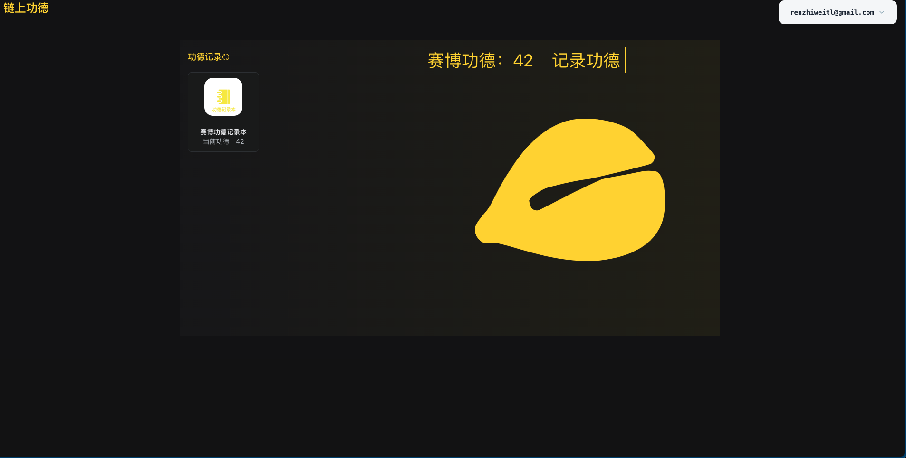

# 赛博功德积攒工具

## 合约部署
> 合约位置在contract目录下

```bash
sui move build
sui client publish
```

## 前端页面启动

安装依赖

```bash
pnpm install
```

开发环境

```bash
pnpm dev
```

生产打包


```bash
pnpm build
```

## 页面截图



